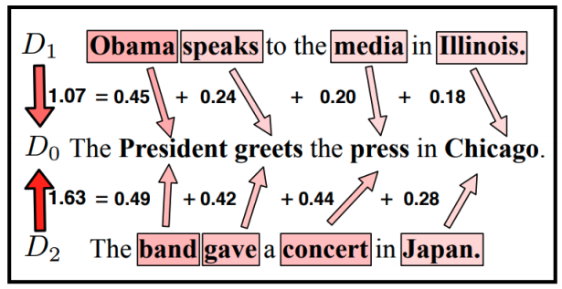
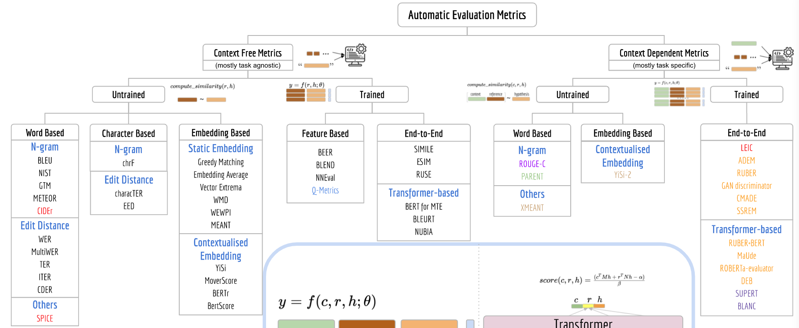

# Evaluation of NLG systems

A blug post regarding evaluations [here](https://thegradient.pub/understanding-evaluation-metrics-for-language-models/) 

A paper: [Evaluation of Text Generation: A Survey](https://arxiv.org/pdf/2006.14799.pdf)

## Accuracy

**Accuracy encodes how often a certain classifier is correct.** A weakness of accuracy is that a classifier could not even classify and only choose the most common category and be considered a good classifier according to the accuracy. 

The accuracy is inversely proportional to the cross entropy loss, from that, $D_{KL}$ Is an analog of accuracy for soft labels. 

**You could only trust accuracy in a balanced problem.**  

## Precision

The sum of correct prediction divided by the sum of all guesses, it is a **per class notion**. 

The value is encodes is a **conservative value** by penalizing incorrect guesses.

##  Recall 

The sum of the correct predictions divided by the sum of all true instances. It is often called the ***True positive rate***. Encode a **permissive value** by penalizing **only missed true** cases.

## F - Scores

Use **precision** and **recall** via some combination according to how sensitive we are to true positives or negatives.  

##  Perplexity

The Cross-Entropy required to describe one distribution using the optimal encoding of the other distribution. The units of cross entropy is like entropy, and comes as *nats*. 

The Perplexity os the exponentiation of the cross entropy, or, how many states can we describe using this residual information. In case the cross entropy is low, there won’t be such many states.

If perplexity is taken over the entropy and not the cross entropy, the perplexity quantity becomes clearer as to how many options per words are there in the sentence, in case this sentence is dull, like “*the the the*”, the (unigram) perplexity per word is low under the English language? 

### [MoverScore: Text Generation Evaluating with Contextualized Embeddings and Earth Mover Distance (Zhao 19)](https://aclanthology.org/D19-1053.pdf)

## N-Gram based

### [BLEU: a Method for Automatic Evaluation of Machine Translation (Papineni 02)](BLEU a Method for Automatic Evaluation of Machine Translation (Papineni 02))

> A lexical similarity metric that measures the generation precision, i.e the fraction of matching n-grams to the total number of generated n-grams, it also include a penalty for shorter generation.

### [ROUGE: A Package for Automatic Evaluation of Summaries (Lin 04)](ROUGE A Package for Automatic Evaluation of Summaries (Lin 04).md)

> A lexical similarity metric, calculated in terms of precision (i.e., how many of the ngrams in the machine-generated text appear in the reference text) and recall (i.e., how many of the n-grams in the re text appear in the machine-generated text), and the resulting F1 score can be calculated.

## Diversity

### [Evaluating the Evaluation of Diversity in Natural Language Generation](Evaluating the Evaluation of Diversity in Natural Language Generation.md)

> Propose an evaluation scheme for diversity metrics, shows that distinct-n correlates well with temperature. Separate between form and contact diversity and show that the former is better measured by n-gram metrics and the latter by humans.

## Deep automatic evaluation

### [How Furiously Can Colorless Green Ideas Sleep? Sentence Acceptability in Context](How Furiously Can Colorless Green Ideas Sleep Sentence Acceptability in Context.md) 

> Study the influence of context on sentence acceptability, Sentence acceptability is the extent to which a sentence appears natural to native speakers of a language. Also. Compared different fluency metrics using different LMs and different configurations.

### [BLEURT: Learning Robust Metrics for Text Generation (Sellam 2020)](BLEURT Learning Robust Metrics for Text Generation (Sellam 2020).md)

> A semantic similarity metric, innovated another (priming) stage of training between the pre-training to the supervised fine-tuning. In this stage, they trained on a large synthetic dataset of sentence pairs and tried to predict a bunch of metrics (BLEU, BertScore etc), this in order to create a signal. 

### [METEOR: An Automatic Metric for MT Evaluation with Improved Correlation with Human Judgments (Banerjee 2005)](https://www.aclweb.org/anthology/W05-0909.pdf)

> 

### [The GEM Benchmark (Gehrmann 21)](https://arxiv.org/pdf/2102.01672.pdf)

> A benchmark for natural language Generation (NLG)

### [Self-Bleu: Texygen: A Benchmarking Platform for Text Generation Models](https://arxiv.org/pdf/1802.01886.pdf) 

 We propose Self-BLEU, a metric to evaluate the diversity of the generated data. Since BLEU aims to assess how similar two sentences are, it can also be used to evaluate how one sentence resembles the rest in a generated collection. Regarding one sentence as hypothesis and the others as reference, we can calculate BLEU score for every generated sentence, and define the average BLEU score to be the Self-BLEU of the document. A higher Self-BLEU score implies less diversity of the document, and more serious mode collapse of the GAN model.

### Word Mover’s Distance (wmd) 

Earth mover’s distance (emd), also known as the Wasserstein metric (Rubner et al., 1998), is a measure of the distance between two probability distributions. Word mover’s distance (wmd; Kusner et al., 2015) is a discrete version of emd that calculates the distance between two sequences (e.g., sentences, paragraphs, etc.), each represented with relative word frequencies. It combines item similarity17 on bag-of-word (BOW) histogram representations of text (Goldberg et al., 2018) with word embedding similarity. In short, wmd has several intriguing properties: 

- It is hyperparameter-free and easy to use. 

- It is highly interpretable as the distance between two documents can be broken down and explained as the sparse distances between few individual words. 

- It uses the knowledge encoded within the word embedding space, which leads to high retrieval accuracy. 

Empirically, wmd has been instrumental to the improvement of many NLG tasks, specifically sentence-level tasks, such as image caption generation (Kilickaya et al., 2017) and natural language inference (Sulea, 2017). However, while wmd works well for short texts, its cost grows prohibitively as the length of the documents increases, and the BOW approach can be problematic when documents become large as the relation between sentences is lost. By only measuring word distances, the metric cannot capture information conveyed in the group of words, for which we need higher-level document representations (Dai et al., 2015).

## Taxonomy of Current automatic evaluation metrics for NLG

### Context Free metrics

Trained metrics use human results as training data (y) along with the reference-hypothesis pair (X), untrained metrics hand-define some distance and use it. 

#### Untrained metrics

##### Word-based 

###### Word n-gram 

Examples are: `BLEU`, `N-GRAM`, `NIST`, `GTM`, `METEOR`, `CIDEr`, [`PARENT`](https://arxiv.org/pdf/1906.01081.pdf). The Method is to make a set of all n-grams of both he reference and hypothesis and compare via an F1 score. These can be expanded by a sort of soft matching for partial correspondence instead of a binary type.

###### Word Edit-distance

Examples: `WER`, `TER` and friends, the distance is measured by the way one could edit the hypothesis to the reference, 

##### Character-based 

###### character n-gram

Examples: `chrF`, they compare n-gram upon characters, works good for languages that tend to connect words.

##### Embedding-based

###### Static Embedding

Examples: `Greedy matching`, `Embedding average`, `Vector extrema`, `WMD`, `WEWPI`, `MEANT`. These metrics take some vector similarity distance like cosine distance. Some methods get sentence level embedding and compare these.

###### Contextualized Embedding

Examples: `YiSi`, `MoverScore`, `BERTr`, `BertScore`. This is the same as above only that the embedding is taken using a transformer such that each word embedding is aware of the other words around it which allows the context to contribute and word meaning to be better clarified.

#### Trained metrics

##### Feature based

Examples: `BEER`, `BLEND`, `NNEVAL` , `Q-METRICS`. These methods create some feature vector from the reference and hypothesis (of say a concatenation of other metrics) and learn to infer a real human score from it. It requires pairs of feature vectors and human scores for training.

##### End-to-End

Examples: `SIMILE`, `ESIM `, `RUSE`, `BERT for MTE`, `BLUERT`, `NUBIA`

### Context Full metrics

#### Untrained metrics

Examples for word and character based methods: `N-GRAM`, `ROUGH-C`, `PARENT`, `XMEANT`, `YiSi-2`. These are similar to the context-free methods only that the context is also considered in the comparison.

#### Trained metrics

##### End-to-End

Examples: `LEIC`, `ADEM`, `RUBER`, `GAN Descriminator`, `CMADE`, `SSREM`,  `RUBER-BERT`, `MaUde`, `ROBERTa-Evaluator`, `DEB`, `SUPERT`, `BLANC`. These methods just take a ANN and trained straight from the hypothesis-reference-contex vectors to get a score that imitates human score.