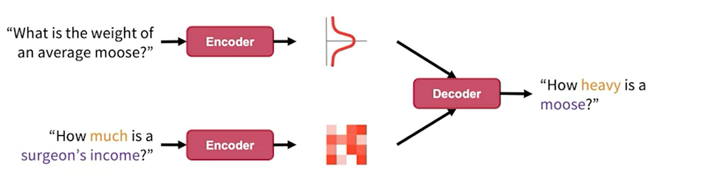
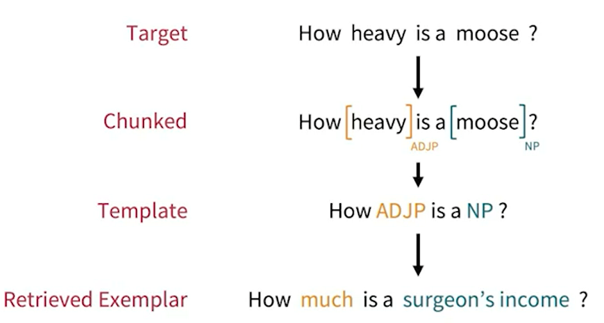
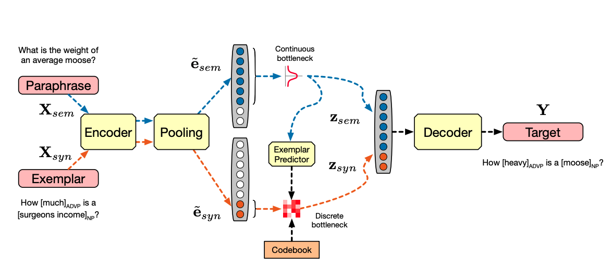

# [Seperator: Factorising Meaning and Form for Intent-Preserving Paraphrasing](https://www.aclanthology.org/2021.acl-long.112) [code](https://github.com/tomhosking/separator)

Separating encoding spaces to generate paraphrases.

A current trend is using some kind of bottleneck like back-translation or VAEs, this however does not constrain the expressiveness of the paraphrase.

Another trend is of syntactic control, in which an input is given along with the sentence with, for example a required syntactic tree. 

The training goes as two sentences are inputted to two separate encoders, these encodinges are then inputted to a decoder that is to create a sentence with a similar meaning as the top and a structure of the bottom.

The meaning encoding is represented in a continuous space while the structure of the other sentence is encoded in a discreet form (with QVAEs)

The matching examples are chosen in the following process:

As test time, there is no exemplar sentence, so the semantic and syntactic encoding of the original sentence will be used to predict a syntactic encoding.

