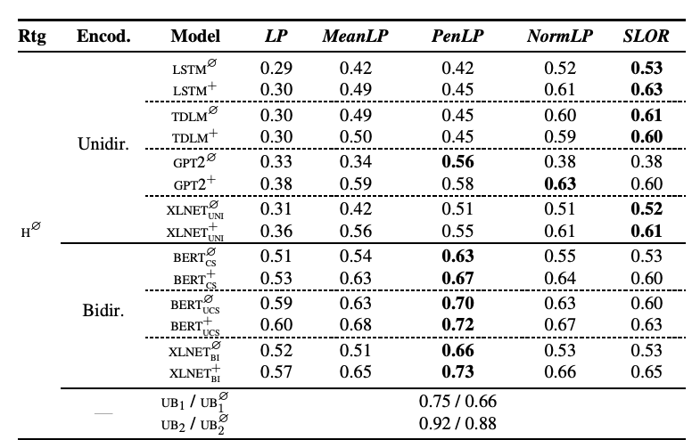
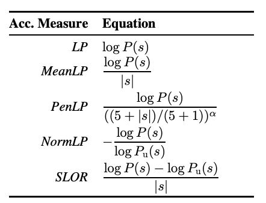

# [How Furiously Can Colorless Green Ideas Sleep? Sentence Acceptability in Context](https://aclanthology.org/2020.tacl-1.20.pdf)

Study the influence of context on sentence acceptability, Sentence acceptability is the extent to which a sentence appears natural to native speakers of a language.

Data is created via back translation over Wikipedia articles.

Conducts a MTURK experiment, that shows that context induces a cognitive load for humans, which compresses the distribution of ratings

**Test unidirectional and bidirectional language models in their ability to predict acceptability ratings.** The bidirectional models show very promising results, with the best model achieving a new state-of-the-art for unsupervised acceptability prediction. 

The best model is shown to be BERT and is not far for having the same correlation to a group of humans as a single human. Tried BERT, GPT2, XLNet and a bunch more models.

> The best model without considering context is BERT∅ UCS with a correlation of 0.70 (PenLP), which is very close to the idealized single-annotator performance UB1 (0.75) and surpasses the unfiltered performance UB∅ 1 (0.66), creating a new state-of-the-art for unsupervised acceptability prediction (Lau et al., 2015, 2017b; Bernardy et al., 2018). There is still room to improve, however, relative to the collaborative UB2 (0.92) or UB∅ 2 (0.88) upper bounds.

Tried a few metrics extracted from the LM, from which, one that was shown to be the best if PenLP $\log{P(s)}/((5+|s|)/(5+1))^\alpha$.

