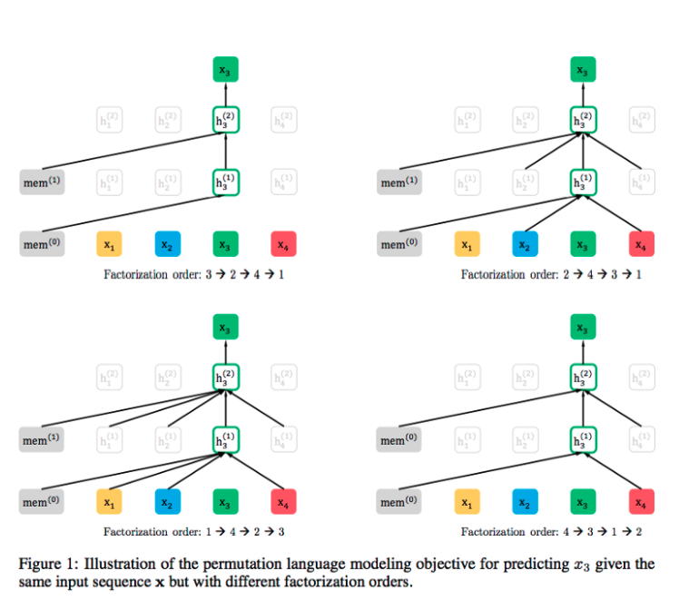
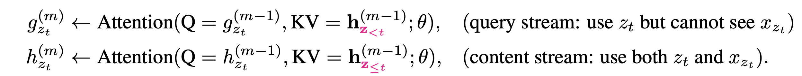
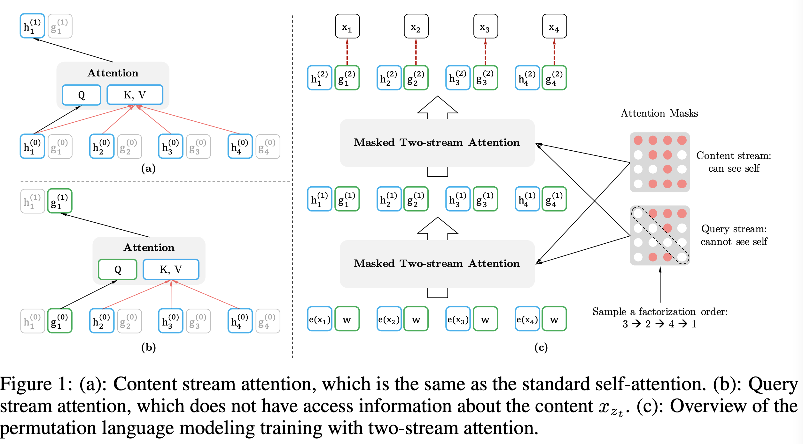

#  Language models

- [A great lecture](https://www.youtube.com/watch?v=knTc-NQSjKA) on the subject going through a few of these models from the author of BERT (Devlin) .
- Another [Great talk by Alec Radford](https://www.youtube.com/watch?v=BnpB3GrpsfM)

[TOC]

### [Transformer: Attention is all you need](Transformer_Attention_is_all_you_need.md) 

## https://www.jmlr.org/papers/volume3/bengio03a/bengio03a.pdf)

  

## [Recurrent neural network based language model (Mikolov 2010)](https://www.isca-speech.org/archive/archive_papers/interspeech_2010/i10_1045.pdf)

- Replace MLP with an RNN

## [Generating Text with Recurrent Neural Networks (Sutskever 2011)](https://icml.cc/Conferences/2011/papers/524_icmlpaper.pdf)

- Character level RNN

## [Generating Sequences With Recurrent Neural Networks](https://arxiv.org/pdf/1308.0850)

- Character level multi-layer  LSTM 

## [Exploring the Limits of Language Modeling (Jozefowicz 2015)](https://arxiv.org/pdf/1602.02410)

## [ELMO: Deep contextualized word representations (Peters 2018)](https://arxiv.org/pdf/1802.05365)

- Replace word vectors with a learned weighted sum of features of deep bi-LSTM
- This work, added to other baseline models that used to work with word vectors got a substantial improvement. 
- Used the language model from Jozefowicz 2015

## [GPT-1: Improving Language Understanding by Generative Pre-Training (Radford 2018)](https://www.cs.ubc.ca/~amuham01/LING530/papers/radford2018improving.pdf)

- Transformer based LM 

- ~100M parameter

- ~5GB books

- Fine-tune on supervised text

- ### Removed the need for text specific architectures

## [BERT: Pre-training of Deep Bidirectional Transformers for Language Understanding (Devlin 2018)](https://arxiv.org/pdf/1810.04805)

A denosing auto-encoder (AE) language model, its innovation is in the fact that it could be bidirectional and include attention by introducing the *Masked LM* task in which some of the words are corrupted are masked and the model has to predict all the words.

### MLM: Masked language modeling

Masked LM and the Masking Procedure Assuming the unlabeled sentence is `my dog is hairy`, and during the random masking procedure choses the 4-th token (which corresponding to `hairy`), the masking procedure can be further illustrated by 

- 80% of the time: Replace the word with the `[MASK]` token, e.g., `my dog is hairy → my dog is [MASK]` 

- 10% of the time: Replace the word with a random word, e.g., `my dog is hairy → my dog is apple` 

- 10% of the time: Keep the word unchanged, e.g., `my dog is hairy → my dog is hairy`. 

The purpose of this is to bias the representation towards the actual observed word. The advantage of this procedure is that the Transformer encoder does not know which words it will be asked to predict or which have been replaced by random words, so it is forced to keep a distributional contextual representation of every input token. 

#### MLM Disadvantages 

1. The [MASK] symbol it uses is not seen in inference and is thus suboptimal (pre-train - fine-tune discrepancy).
2. The [MASK] symbols makes it harder for the model to predict the other masked words.

The model is asked to predict the corrupted words rather than reconstructing the entire input, this makes for both less training efficiency and makes the sampling less trivial.

### Another pre-train / fine-tune method

Similar to GPT-1, BERT used a scheme where most of the model is pertained and each specific task gets just one additional layer to train on. 

## [RoBERTa: A Robustly Optimized BERT Pre-training Approach (Liu 2019)](https://arxiv.org/abs/1907.11692)

A plain BERT with more data and epochs, got much better results than BERT.

RoBERTa is better tuned, used more compute and train time (it turned out that BERT was undertrained).

RoBERTa used better masking mechanism where the mask were chosen at each step as opposed to BERT where their location was cached. 

Used a a more flexible vocabulary scheme

## [XLNet: Generalized Autoregressive Pretraining for Language Understanding](https://arxiv.org/pdf/1906.08237)

This one Is an autoregressive (AR) model more like GPT, however, XLNet is generalized to allow it to be bidirectional.

XLNet propose a new way to **let the AR language model learn from bi-directional context** to avoid the disadvantages brought by the MASK method in AE language model.

### Generalized Autoregressive

The idea is that XLNet will predict the words (in the example below its $x_3$) in an autoregressive manner, but every time the small comes up from the training set, the sentence will be in a different permutation order so it will attend to the words before it. As we see below, $x_3$ attends to different sets every time the sample comes up, this way, the model will both learn how to attend to both directions and will learn to predict with different contexts including full contexts unlike BERT.   

#### Parallel prediction

XLNet would like to output several prediction from the model in a single pass in a similar manner as BERT does, however, as opposed to BERT, the word predicted should not be masked in favor of the prediction of the next words. In order to circumvent this issue, the *Masked Two-stream Attention* mechanism has been introduced where for each of the attention transformed words there are two instantiation, one where it is allowed to attend itself (used by the next words predicted) and one that has itself masked away.

#### Points taken from TransformerXL

TransformerXL adds the notion of *memory* of the last sequence, this is a trick that allows to carry over more information in a gradient free way.

TransformerXL uses [relative-positional encoding](https://arxiv.org/pdf/1803.02155.pdf) instead of global positional encoding which allows for longer sequences and better performance.

## [ALBERT: A Lite BERT for Self-supervised Learning of Language Representations](https://arxiv.org/pdf/1909.11942)

Factorizing the embedding block + parameter sharing allows for larger models to be trained and improved results.

### Factorized embedding

They factorized the embedding parametrization by using a smaller embedding size (128) and then projected it to the transformer hidden states size of 1024, this means that instead of having a matrix of 100k times 1024 you have one matrix of 100k times 128 and 128 times 1024 which constitutes for a 80% reduction in the number of parameters (and computations) of this block. 

The authors show that this reduction almost does not influence overall performance.

### Cross layer parameter sharing (form Universal Transformer)

All transformer layers share the same parameters which makes for much better sample efficiency and allows for larger models to be trained, parameter sharing reduces parameter count in more that 90%. 

We note that this parameter sharing does hurt performance in the case of a similar architecture and in order for ALBERT to beat BERT in terms of accuracy, a much heavier architecture is to be used which makes run time much slower (since parameter sharing does not speed up inference). This heavier architecture would not have been possible without the above design choices and thus, their method is not a simple scaling up of BERT but allows a method to make sequence length and depth larger while keeping the same hardware and training set.

## [T5: Exploring the Limits of Transfer Learning with a Unified Text-to-Text Transformer (Raffel 2019)](https://arxiv.org/pdf/1910.10683)

[Youtube video](https://www.youtube.com/watch?v=eKqWC577WlI)

A thorough ablation study of aspects of pre-training.

Main conclusions:

1. Scaling up model size and dataset size is the main path to improvement
2. Exact masking/corruption numbers (10%, 15%, 20% etc.) does not really matter

## [ELECTRA: Pre-training Text Encoders as Discriminators Rather Than Generators (Clark 2019)](https://openreview.net/forum?id=r1xMH1BtvB)

Instead of generating the output, train to model to discriminate the words as coming from the real or fake distribution. This gives better sample efficiency since every word is predicted.

The authors were able to show SOTA results but only when the models were scaled to the same order of magnitude as the previous SOTA models. 

### [PEGASUS: Pre-training with Extracted Gap-sentences for Abstractive Summarization](PEGASUS Pre-training with Extracted Gap-sentences for Abstractive Summarization.md)

## [BART: Denoising Sequence-to-Sequence Pre-training for Natural Language Generation, Translation, and Comprehension](https://arxiv.org/pdf/1910.13461.pdf)

## [GPT-3: Language models are Few-Shot Learners](https://arxiv.org/abs/2005.14165) 

A language model is a model that can predict the next word in a sentence.

The paper shows that by scaling up the model you can keep getting better language model results.

### Some quantities

GPT-3 is trained on ~5B letters, it needs 3 order of magnitude more FLOPs to train than BERT, has x10 more parameters than the next largest model and x100 larger than GPT-2, it has 96 attention layers with 96 heads each, Batch size is 3.2M. It is just a larger version of GPT-2 with much more data.

### Results

Q&A: In the Q&A task, as the model is scaled, it can achieve results like a SOTA fine tuned version even with zero-shot!

Tranlation: All languages to English are as good.

Winograd: Not as good as the SOTA but on par with the SOTA of 2019: Physical Q&A (who the world works)

Beats the SOTA although there should be some contamination since their datasets had some of the task dataset.

[Language Models are Unsupervised Multitask Learners (Radford 2019)](https://cdn.openai.com/better-language-models/language_models_are_unsupervised_multitask_learners.pdf)

Natural language processing tasks, such as question answering, machine translation, reading comprehension, and summarization, are typically approached with supervised learning on task specific datasets. We **demonstrate that language models begin to learn these tasks without any explicit supervision when trained on a new dataset of millions of webpages called WebText**. 

When conditioned on a document plus questions, the answers generated by the language model reach 55 F1 on the CoQA dataset - matching or exceeding the performance of 3 out of 4 baseline systems without using the 127,000+ training examples. 

The capacity of the language model is essential to the success of zero-shot task transfer and **increasing it improves performance in a log-linear fashion across tasks**. Our largest model, GPT-2, is a 1.5B parameter Transformer that achieves state of the art results on 7 out of 8 tested language modeling datasets in a zero-shot setting but still underfits WebText. **Samples from the model reflect these improvements and contain coherent paragraphs of text**. These findings suggest a promising path towards building language processing systems which learn to perform tasks from their naturally occurring demonstrations.

## [Sentence-BERT: Sentence Embeddings using Siamese BERT-Networks (Reimers 19)](https://arxiv.org/pdf/1908.10084.pdf)

BERT (Devlin et al., 2018) and RoBERTa (Liu et al., 2019) has set a new state-of-the-art performance on sentence-pair regression tasks like semantic textual similarity (STS). However, it requires that both sentences are fed into the network, which causes a massive computational overhead: Finding the most similar pair in a collection of 10,000 sentences requires about 50 million inference computations (~65 hours) with BERT. The construction of BERT makes it unsuitable for semantic similarity search as well as for unsupervised tasks like clustering. In this publication, we present Sentence-BERT (SBERT), a modification of the pretrained BERT network that use siamese and triplet network structures to derive semantically meaningful sentence embeddings that can be compared using cosine-similarity. This reduces the effort for finding the most similar pair from 65 hours with BERT / RoBERTa to about 5 seconds with SBERT, while maintaining the accuracy from BERT. We evaluate SBERT and SRoBERTa on common STS tasks and transfer learning tasks, where it outperforms other state-of-the-art sentence embeddings methods.

# Sampling

## [The Curious Case of Neural Text Degeneration (Ari Holtzman 2019) ](https://arxiv.org/pdf/1904.09751)

The counter-intuitive empirical **observation is that even though the use of likelihood as training objective leads to high quality models for a broad range of language understanding tasks, using likelihood as a decoding objective leads to text that is bland and strangely repetitive.**
In this paper, we reveal **surprising distributional differences between human text and machine text.** In addition, we find that decoding strategies alone can dramatically effect the quality of machine text, even when generated from exactly the same neural language model. Our findings motivate **Nucleus Sampling,** a simple but effective method to draw the best out of neural generation. 

By **sampling text from the dynamic nucleus of the probability distribution**, which allows for diversity while effectively truncating the less reliable tail of the distribution, the resulting text better demonstrates the quality of human text, yielding enhanced diversity without sacrificing fluency and coherence.

## NMT

### [Neural Machine Translation By Jointly Learning To Align And Translate](Neural Machine Translation By Jointly Learning To Align And Translate.md)

> TODO

### [A Neural Probabilistic Language Model (Bengio et al. 2003)](A Neural Probabilistic Language Model.md)

> TODO

