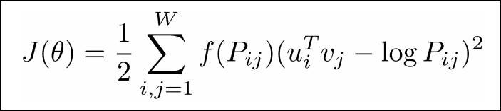
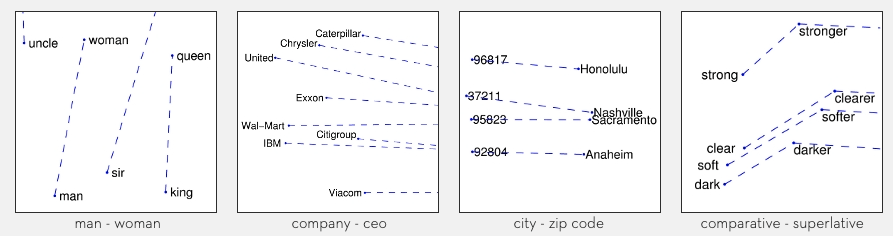
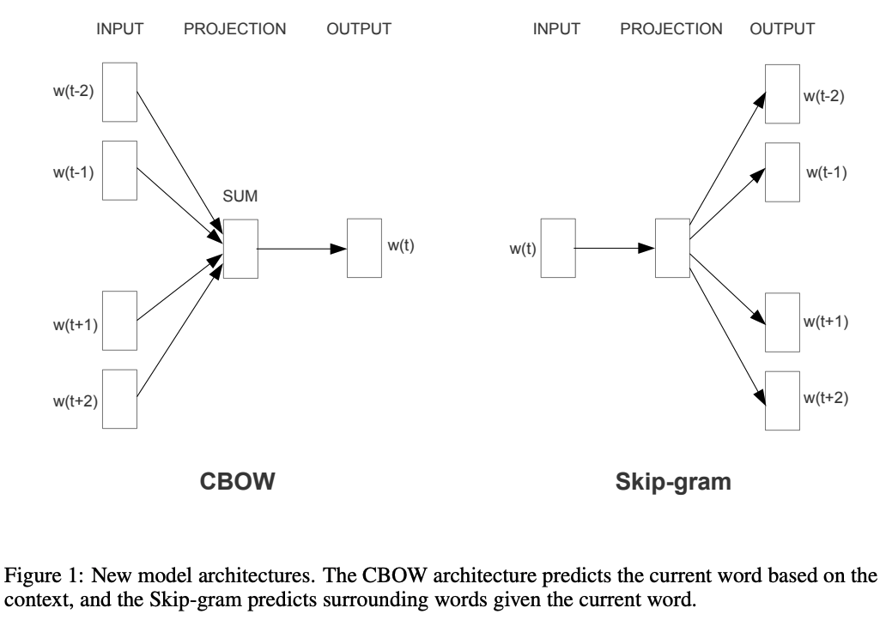

# NLP methods

## General

### [Combining Retrieval, Statistics, and Inference to Answer Elementary Science Questions](https://www.aaai.org/ocs/index.php/AAAI/AAAI16/paper/download/11963/11990)

Used an information retrieval method to count cooccurrences in the web in order to gain 60% accuracy in a question answering task (up from 25% of a random guess).

This results is surprisingly good given the simplicity of this method, it is basically just seeing which of the answer have a larger normalized cooccurrence with the question.

A problem with this kind of relationship table between words is the size of it, given that we have ~1M tokens, we will have `1M x 1m x 4 byte int32 = 4TB`.

## Word Vectors and   Embedding

### [GloVe: Global Vectors for Word Representation](https://nlp.stanford.edu/pubs/glove.pdf)

The general idea behind this method is that they learn a `300` dimension vector representation for the words such that the dot product between two words will give their value of their cooccurrence table. This way, instead of having a cooccurrence table of `1Mx1M` we will have `1Mx300` entries.

> Our model efficiently leverages statistical information by training only on the nonzero elements in a word-word cooccurrence matrix, rather than on the entire sparse matrix or on individual context windows in a large corpus. The model produces a vector space with meaningful substructure, as evidenced by its performance of 75% on a recent word analogy task. It also outperforms related models on similarity tasks and named entity recognition.

This is the loss used:

Glove maps semantics in to some of its dimensions:

### [Word2Vec: Efficient Estimation of Word Representations in Vector Space](https://arxiv.org/pdf/1301.3781)

Building representation according to the prediction ability the dot product between words allows. CBOW predict the center word from the context while Skip-gram predicts the context from the center word.

In the above figure, the prediction actually takes place by doing a dot product so that each of the outputs predicted are just the dot product of the input word or bag-of-words and the output.

Many tricks were used here using the frequency of words (s.t for example the word the is ignored in many appearances since it usually constitutes ~7% of the data…) 

## [BPE: Neural Machine Translation of Rare Words with Subword Units](https://arxiv.org/pdf/1508.07909)

It is a tokenization method that merges groups of characters that appear often as separate tokens. It is an iterative process as more and more tokens like this are gathered.

For example, token will first be created to the most common pairs like *th*, *in* or *an*, than, it will be created for triplets like *the* or *and* etc.

You start with a byte level and and stop once you get around 32K different token, in the limit that we would allow for more, we will start seeing words like neurobiology being merged even though we would like it to stay as near and biology...

