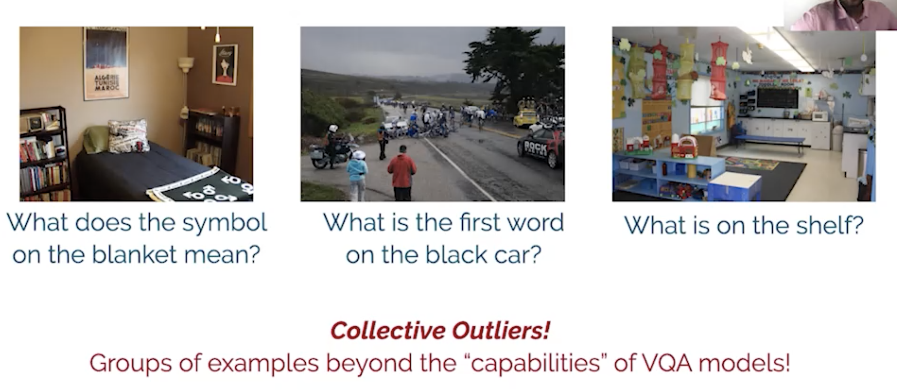
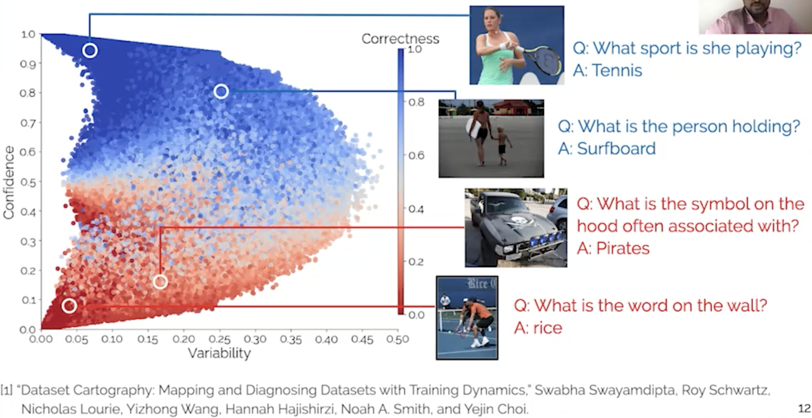
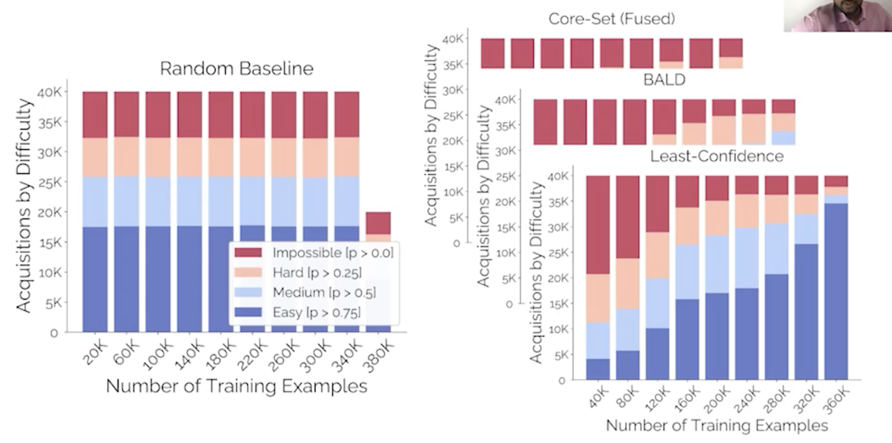

# [Mind Your Outliers! Investigating the Negative Impact of Outliers on Active Learning for Visual Question Answering](https://www.aclanthology.org/2021.acl-long.564)

[slides](https://d3smihljt9218e.cloudfront.net/lecture/25476/slideshow/77fa0122416d5e7eba6caa60d96bf8d6.pdf) [video](https://underline.io/events/167/sessions/6092/lecture/25476-mind-your-outliers!-investigating-the-negative-impact-of-outliers-on-active-learning-for-visual-question-answering) 

Tried to improve a VQA system by adding interaction with human, i.e: let one set of annotators evaluate performance and another set find patterns and curate more examples for training.

This sounds like an *Active learning scenario*, and indeed the authors tried to simulate the above process in this framework. The authors tried to use a few active learning methods for this and saw that choosing randomly from a larger train set as opposed to letting the model pick from it gives better results. In other words -> AL for VQE does not work. WHY?

> The goal of the paper: find out what is holding AL back for VQA 

Authors found that the effect persists across data, architectures and AL methods

Next steps was to look at the examples that the AL methods suggest to the VQA as more data. Found that the samples AL suggests are examples that are thought of as *beyond the capabilities of VQA models *

To further strengthen this point, the authors mapped the VQA dataset:

Where, in this graph we can see examples that are always classified with low confidence by the model… these are the hardest examples. 

AL is picking these hard examples, which do not really help the model with a greater quantity: 

But what if we remove these hordes examples?

As these collective hard examples removed, the AL methods start to perform better that Random, these are the ones that hold AL back.