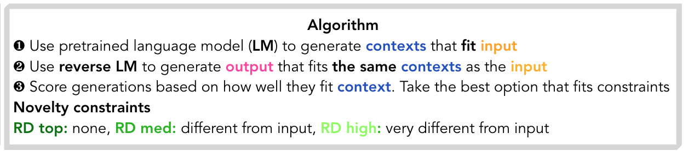
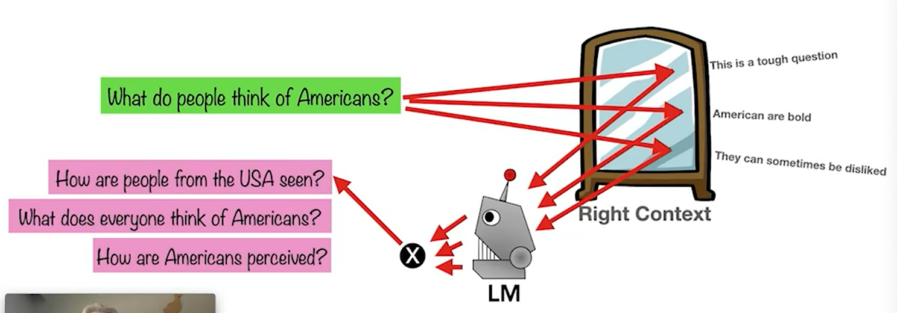
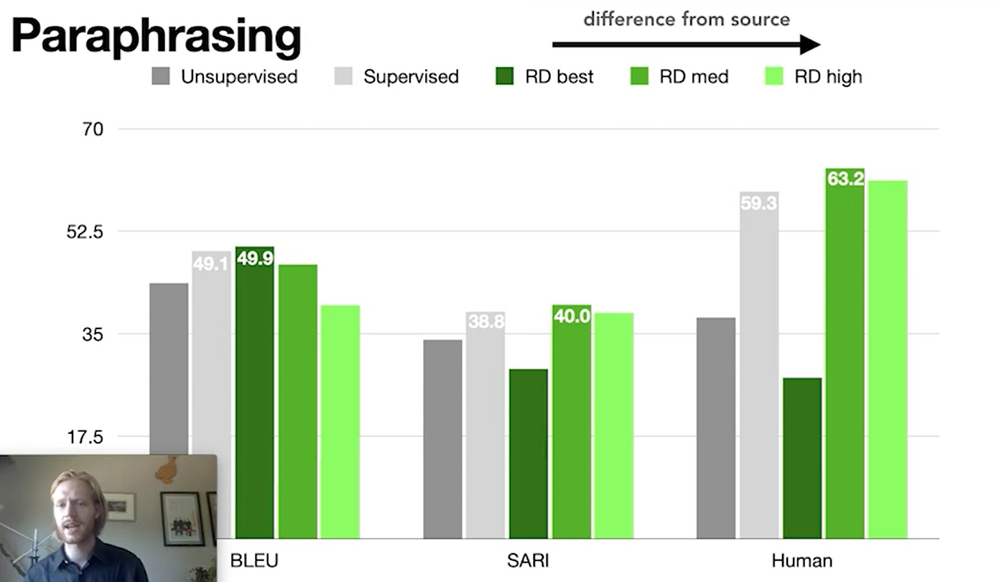
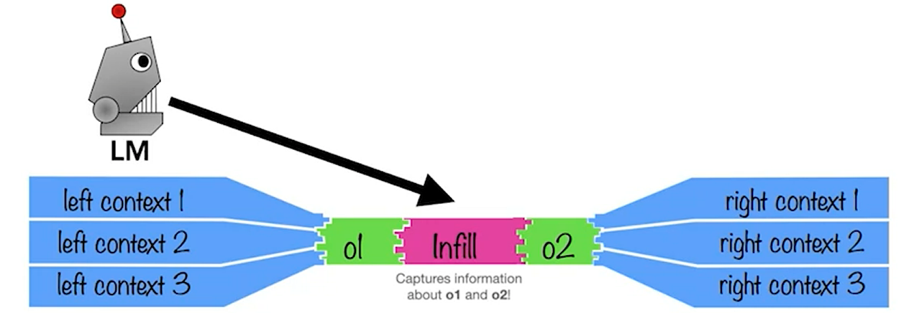

# [Reflective Decoding: Beyond Unidirectional Generation with Off-the-Shelf Language Models (West 21)](https://www.aclanthology.org/2021.acl-long.114) 

[talk](https://underline.io/events/167/posters/6065/poster/26006-reflective-decoding-beyond-unidirectional-generation-with-off-the-shelf-language-models) 

Reflective decoding is done in two steps:

1. Source sentence is inputted to a LTR LM that predicts the context, see below to the right of the mirror.
2. Context sentences are inputted to a RTL LM that predicts the original sentence. 

The same thing can be done with a RTL LM first and then a LTR LM.

Since there is no syntactical constraint, these paraphrases should keep the meaning but not form.

After the candidates are created, the top ones are ranked according to their contextualized distance (==does this means the LM prob?==)  and to some diversity metrics:

As shown in the above figure, taking the best conceptualized score will maximize BLEU but for humans and the SARI score, taking the top without being concerned about novelty will not be good.  

The same framework also applies to infiling:

As the left and right contexts are created with both O1 and O2, and then the LM creates the infill from the contexts and O1 (for examples, from the left…).

Results are indeed much better than other unsupervised methods that only condition on one of the O’s for each direction.

Using $Novelty(ˆs) = 100 − BLEU(\hat{s}, s_{input}) $​​​  for diversity…

The paraphrasing results seems impressive as this unsupervised methods is able to beat the supervised methods. 
